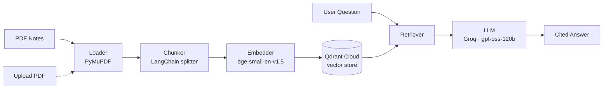

# 📚 RAG Knowledge Assistant

A production-style Retrieval-Augmented Generation (RAG) system that answers questions grounded in your own study notes — with citations, live document uploads, and a measured, tuned retrieval pipeline. Built end-to-end, entirely on free-tier tools.

> Ask a question → the system retrieves the most relevant chunks from your notes → an LLM generates an answer using *only* that context → every answer is cited back to its source document and page.

---

## ✨ Features

- **Grounded, cited answers** — the LLM is instructed to answer only from retrieved context and cite `[source, page]`; if nothing relevant is found, it says so instead of hallucinating.
- **Live document ingestion** — add new PDF notes through the running app itself via an `/upload` endpoint. No redeploy, no manual re-run of scripts.
- **Deterministic chunk IDs** — chunks are keyed by a UUID derived from `(source, page, position)`, so re-uploading a file updates its own chunks instead of duplicating or colliding with others.
- **Evaluated, not assumed** — retrieval quality is measured with a small labeled question set (`eval/`), not just eyeballed.
- **Fully free stack** — every component runs on a free tier; nothing here requires a paid API key or paid hosting.

---

## 🏗️ Architecture



Two entry points into the same ingestion pipeline: a one-time bulk load (`src/ingestion/embedder.py`, run directly) and a live `/upload` API endpoint that calls the same loader → chunker → embedder functions. Neither path duplicates logic.

---

## 🧰 Tech Stack

| Layer | Tool | Why |
|---|---|---|
| PDF parsing | PyMuPDF (`fitz`) | Fast, reliable text extraction, page-level metadata |
| Chunking | LangChain `RecursiveCharacterTextSplitter` | Overlap-aware splitting, clean sentence boundaries |
| Embeddings | `sentence-transformers` (`BAAI/bge-small-en-v1.5`) | Runs locally/CPU, free forever, strong small-model retrieval quality |
| Vector store | Qdrant Cloud (free tier) | Persists across restarts — unlike a local Chroma folder on ephemeral hosting |
| LLM | Groq API (`openai/gpt-oss-120b`) | Free tier, fast inference, no local GPU needed for deployment |
| Backend | FastAPI | `/ask` and `/upload` endpoints, auto-generated docs |
| Frontend | Streamlit | Chat interface + live upload UI |
| Hosting | Hugging Face Spaces (free) | Public live link, no local server required |

---

## 📊 Evaluation

Retrieval quality is measured against a small labeled question set (`eval/eval_questions.json`) rather than assumed. Each question has a known correct `(source, page)`, and `eval/evaluate.py` checks whether that chunk appears in the top-k retrieved results.

**Baseline → tuned: 60% → 80% retrieval accuracy**

| Step | Accuracy | What changed |
|---|---|---|
| Initial baseline | 3/5 (60%) | Default `top_k=5` |
| After root-causing failures | 3/5 (60%) | Ruled out duplicate/orphaned vector points as the cause (verified, not assumed) |
| After tuning `top_k` | 4/5 (80%) | Diagnosed that the missed chunk ranked 6th, just outside `top_k=5` → raised `top_k` to 8 |

The one remaining failure is a genuinely hard case: several chunks in the same source document independently mention the queried concept, so the target chunk competes with near-duplicate-topic chunks for a fixed number of retrieval slots. Rather than keep raising `top_k` to force a 100% pass rate on a 5-question set (which would overfit to this test set and dilute answer quality with more marginal sources), this is documented as a known limitation with a clear next step.

**Possible future improvements:**
- Reranking retrieved candidates with a cross-encoder before passing to the LLM
- Hybrid search (keyword + semantic) for concept-dense documents
- Expanding the eval set beyond 5 questions for a more statistically meaningful score

---

## 📁 Project Structure

```
rag-knowledge-assistant/
├── data/
│   └── raw_pdfs/              # source PDFs (gitignored)
├── vectorstore/                # (unused locally — storage is on Qdrant Cloud)
├── src/
│   ├── ingestion/
│   │   ├── loader.py           # PDF → per-page text
│   │   ├── chunker.py          # text → overlapping chunks, deterministic UUIDs
│   │   ├── embedder.py         # chunks → embeddings → Qdrant
│   │   └── reset_collection.py # utility: wipe and rebuild the vector collection
│   ├── retrieval/
│   │   └── retriever.py        # query → top-k relevant chunks
│   ├── generation/
│   │   ├── prompts.py          # grounded-answer prompt templates
│   │   └── llm.py              # Groq API wrapper
│   └── pipeline.py             # ties retrieval + generation into one call
├── api/
│   └── main.py                 # FastAPI: /ask, /upload, /stats
├── app/
│   └── streamlit_app.py        # chat UI + live upload UI
├── eval/
│   ├── eval_questions.json     # labeled retrieval test set
│   └── evaluate.py             # retrieval accuracy harness
├── requirements.txt
├── .env.example
└── README.md
```

---

## 🚀 Setup

**1. Clone and install:**
```bash
git clone <your-repo-url>
cd rag-knowledge-assistant
python -m venv venv
venv\Scripts\activate          # Windows
pip install -r requirements.txt
```

**2. Set up your environment variables** — copy `.env.example` to `.env` and fill in:
```
GROQ_API_KEY=          # from console.groq.com
QDRANT_URL=             # from cloud.qdrant.io
QDRANT_API_KEY=
```

**3. Add your notes and build the index:**
```bash
# drop PDFs into data/raw_pdfs/, then:
python -m src.ingestion.embedder
```

**4. Run the backend:**
```bash
uvicorn api.main:app --reload
```

**5. Run the frontend** (in a separate terminal):
```bash
streamlit run app/streamlit_app.py
```

---

## 🔌 API Reference

| Endpoint | Method | Description |
|---|---|---|
| `/` | GET | Health check |
| `/ask` | POST | `{"question": str, "top_k": int}` → `{"answer": str, "sources": list}` |
| `/upload` | POST | Multipart PDF upload → chunks, embeds, and indexes it immediately |
| `/stats` | GET | Total indexed documents and chunks |

Interactive docs available at `/docs` once the backend is running.

---

## 👤 Author

**Liyakat Ali Joo**

AI Researcher/ML Engineer.
